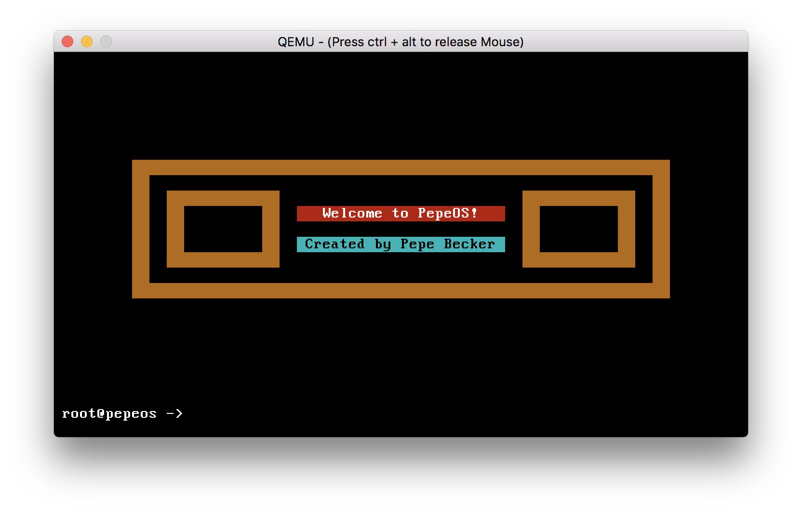

# PepeOS

[](https://opensource.org/licenses/MIT)
[](https://gitter.im/pepebecker)

## Requirements

To build and emulate the kernel you need to have these tools installed:

* nasm
* cross-compiler (for the i686-elf target)
* qemu

>This repository includes a **cross-compiler** for the **i686-elf** target which I built on **macOS Sierra** using **gcc-7.2.0**. If you are using a recent version of macOS, you should be able to use this cross-compiler without any problems.

If you want to build an **iso** you also need to have the following tools installed on your system:

* grub
* xorriso

## Usage

```bash
make kernel  # builds the kernel
make iso     # builds the kernel and iso
make         # same as make iso
runk         # starts qemu with the kernel
run          # starts qemu with the iso
clean        # removed the dist directory
```

## Screenshot



## Contributing

If you **have a question**, **found a bug** or want to **propose a feature**, have a look at [the issues page](https://github.com/pepebecker/pepeos/issues).
